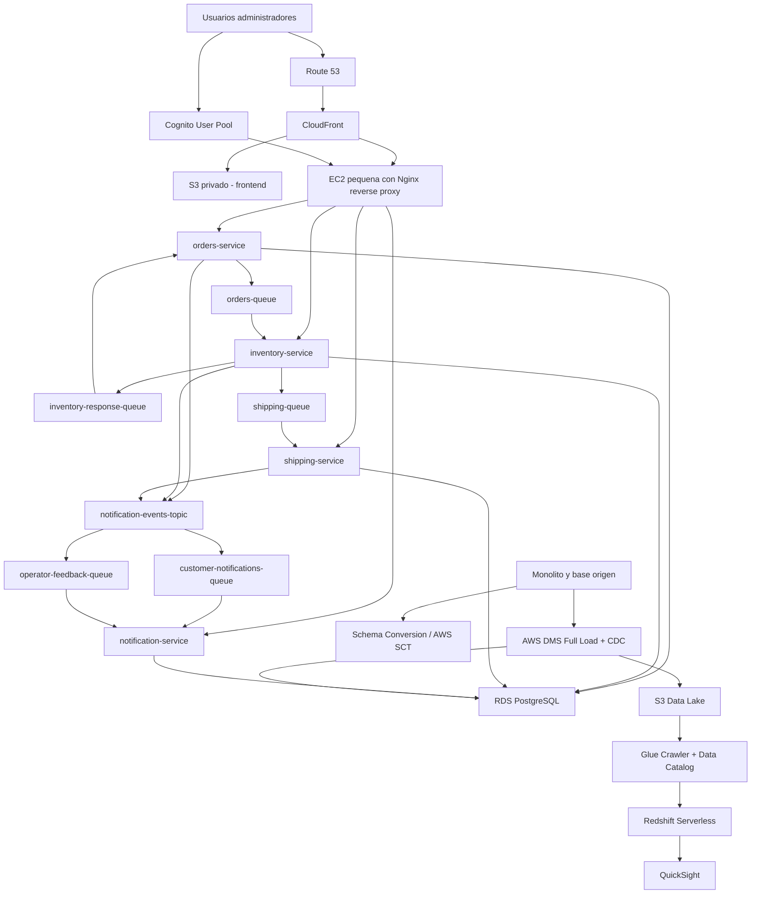

# Arquitectura Final AWS SmartLogix

## Objetivo

Esta arquitectura final propone una solucion moderna para SmartLogix orientada a PYMEs de eCommerce, con foco en:

- gestion de inventario en tiempo real,
- procesamiento de pedidos con trazabilidad,
- coordinacion de envios,
- sincronizacion de datos desde el monolito por base de datos,
- reporteria y analitica para negocio.

La propuesta prioriza una primera etapa simple de operar, sin Kubernetes, usando ECS como plataforma de contenedores.

## Decision principal

La arquitectura recomendada para SmartLogix es:

- frontend estatico en `S3 + CloudFront`,
- autenticacion con `Cognito`,
- entrada HTTP por `EC2 pequena con Nginx`,
- microservicios en `ECS Fargate`,
- persistencia operacional en `RDS PostgreSQL`,
- mensajeria asincrona con `SQS + SNS`,
- migracion y CDC desde monolito con `AWS DMS`,
- analitica con `S3 + Glue + Redshift + QuickSight`.

## Diagrama general

## Capas de la solucion

### 1. Capa de experiencia

Componentes:

- `Route 53`
- `CloudFront`
- `S3`
- `Cognito`

Funcion:

- publicar el frontend web de SmartLogix,
- servir contenido estatico con baja latencia,
- proteger la entrada publica,
- autenticar administradores y operadores.

Decision:

- `smartlogix.cl` y `www.smartlogix.cl` apuntan a `CloudFront`.
- el frontend se publica en un bucket `S3` privado usando `Origin Access Control`.
- `Cognito` administra registro, login, verificacion de correo y recuperacion de acceso.

### 2. Capa de entrada HTTP

Componente:

- `EC2` pequena con `Nginx`

Funcion:

- terminar TLS,
- hacer reverse proxy,
- enrutar por path a los microservicios,
- aplicar reglas simples de rate limiting y headers de seguridad,
- reducir costo frente a un `ALB` administrado en la primera etapa.

Routing recomendado:

- `/api/orders` -> `orders-service`
- `/api/inventory` -> `inventory-service`
- `/api/shipping` -> `shipping-service`
- `/api/notifications` -> `notification-service`

Observacion:

- esta decision es valida para un MVP y control de costos.
- cuando el trafico o la disponibilidad requerida aumenten, el siguiente paso natural es migrar a `ALB`.

### 3. Capa de microservicios

Componente:

- `ECS Fargate`
- imagenes en `ECR`

Microservicios:

- `orders-service`
- `inventory-service`
- `shipping-service`
- `notification-service`

Funcion:

- desacoplar dominios funcionales,
- escalar cada servicio de forma independiente,
- aislar cambios funcionales y operativos.

### 4. Capa de datos operacionales

Componente:

- `RDS PostgreSQL`

Funcion:

- almacenar el estado transaccional del sistema,
- mantener datos operacionales de pedidos, inventario, envios y notificaciones.

Decision:

- idealmente usar una base por bounded context o al menos esquemas separados por servicio.
- la base debe estar en subred privada, cifrada con `KMS` y sin acceso publico.

### 5. Capa de mensajeria

Componente:

- `SQS`
- `SNS`

Funcion:

- desacoplar flujos de negocio,
- soportar procesamiento asincrono,
- mejorar tolerancia a picos de demanda,
- permitir fan-out de eventos para notificaciones.

Flujo principal:

1. `orders-service` registra el pedido.
2. publica evento a `orders-queue`.
3. `inventory-service` valida stock.
4. responde a `inventory-response-queue`.
5. si hay stock, publica a `shipping-queue`.
6. `shipping-service` crea el envio.
7. eventos relevantes se publican a `SNS`.
8. `notification-service` consume colas derivadas y deja trazabilidad.

### 6. Capa de integracion con el monolito

Componente:

- `AWS Schema Conversion Tool` o `DMS Schema Conversion`
- `AWS DMS`

Funcion:

- extraer estructura y datos desde el monolito,
- cargar datos iniciales en AWS,
- mantener sincronizacion incremental mediante CDC.

Decision recomendada:

- usar `SCT / DMS Schema Conversion` para transformar el schema,
- usar `DMS Full Load + CDC` para poblar `RDS`,
- no usar `DMS -> SQS`, porque ese no es un target soportado.
- el camino vigente de integracion es base de datos a base de datos, sin webhooks ni marketplaces en esta etapa.

### 7. Capa analitica y BI

Componente:

- `S3 Data Lake`
- `Glue Crawler`
- `Glue Data Catalog`
- `Redshift Serverless`
- `QuickSight`

Funcion:

- separar analitica de la carga operacional,
- construir datasets para reportes,
- habilitar inteligencia de negocios y tableros para usuarios.

Flujo recomendado:

1. `DMS` replica datos operacionales o historicos hacia `S3`.
2. `Glue Crawler` detecta estructura.
3. `Glue Data Catalog` registra tablas.
4. `Redshift Serverless` consulta y modela datasets analiticos.
5. `QuickSight` expone dashboards de negocio.

## Diseno de red recomendado

Aunque la operacion inicial use una sola instancia Nginx, la VPC debe quedar preparada para crecer.

### VPC

- una `VPC` principal para SmartLogix

### Subredes publicas

- `2 subredes publicas`, una por AZ

Uso:

- `CloudFront` no vive dentro de la VPC, pero la EC2 de `Nginx` puede ubicarse aqui si recibira trafico publico directo.
- si decides salida administrada a internet para privados, aqui iran los `NAT Gateway`.

### Subredes privadas de aplicacion

- `2 subredes privadas app`, una por AZ

Uso:

- `ECS Fargate`
- `service discovery`
- `VPC endpoints`

### Subredes privadas de datos

- `2 subredes privadas data`, una por AZ

Uso:

- `RDS PostgreSQL`

### Subredes privadas de migracion

- `2 subredes privadas migration`, una por AZ

Uso:

- `AWS DMS`

## Seguridad por grupos

### SG-Nginx

- entrada `443` desde internet o restringido a `CloudFront` si aplicas esa estrategia
- salida solo hacia `SG-ECS`

### SG-ECS

- entrada solo desde `SG-Nginx`
- salida hacia `SG-RDS`, `SQS`, `SNS`, `CloudWatch`, `Secrets Manager`

### SG-RDS

- entrada `5432` solo desde `SG-ECS` y `SG-DMS`

### SG-DMS

- salida solo a la base origen y al target `RDS`

## Seguridad recomendada

### Seguridad externa

- `HTTPS` obligatorio con certificados `ACM`
- `AWS WAF` delante de `CloudFront`
- reglas anti-bot, anti-scanner y rate limiting
- cabeceras seguras en `Nginx`
- proteccion de login con `Cognito`

### Seguridad interna

- `RDS` sin acceso publico
- secretos en `Secrets Manager`
- cifrado en reposo con `KMS`
- cifrado en transito entre servicios y base
- `IAM roles` por tarea ECS
- `CloudWatch Logs`, `VPC Flow Logs`, `GuardDuty` y `Security Hub`
- administracion de la EC2 por `SSM Session Manager`, evitando abrir `SSH`
- uso de `IMDSv2` en EC2

### Seguridad de identidad

- usuarios autenticados en `Cognito`
- verificacion de correo obligatoria
- opcion de validar dominios permitidos por empresa cliente
- soporte futuro para `MFA` en perfiles administrativos

## Dominio y publicacion

Configuracion recomendada:

- `smartlogix.cl` -> `CloudFront`
- `www.smartlogix.cl` -> `CloudFront`
- `api.smartlogix.cl` -> `EC2 Nginx`

Alternativa:

- usar un solo dominio y enrutar `/api/*` por `CloudFront` hacia el origen `Nginx`

## Decisiones de costo

Para una etapa inicial orientada a MVP:

- `Nginx en EC2 pequena` reduce costo frente a `ALB`
- `ECS Fargate` evita administrar clusters
- `Redshift Serverless` evita aprovisionamiento permanente grande
- `S3 + CloudFront` es la forma mas simple y economica para frontend

Tradeoff:

- la EC2 con `Nginx` queda como punto unico de falla si despliegas una sola instancia
- si el producto escala, el reemplazo recomendado es `ALB + Auto Scaling`

## Disponibilidad

El negocio puede arrancar con una sola instancia `Nginx`, pero la arquitectura base debe contemplar dos AZ por estas razones:

- `RDS subnet groups` requieren subnets en al menos dos AZ
- `DMS replication subnet groups` requieren subnets en al menos dos AZ
- deja preparado el camino a alta disponibilidad sin rediseñar la red

## Servicios AWS a emular o validar con LocalStack

Servicios razonables para desarrollo local:

- `SQS`
- `SNS`
- `Lambda`
- `Cognito` basico
- `Route 53` a nivel de registros
- `API Gateway`
- `ECR`
- `ECS`

Servicios que conviene validar despues en AWS real:

- `CloudFront`
- `DMS`
- `Glue`
- `Redshift`
- `QuickSight`
- networking real de `security groups`, `private subnets`, `VPC endpoints`

## Roadmap recomendado

### Fase 1

- levantar microservicios core
- desplegar frontend en `S3 + CloudFront`
- autenticar con `Cognito`
- exponer API por `Nginx`
- usar `RDS` y `SQS/SNS`

### Fase 2

- comenzar migracion con `SCT + DMS`
- sincronizar datos historicos y cambios del monolito
- ajustar el modelo operacional en `RDS`

### Fase 3

- habilitar `S3 Data Lake`
- catalogar con `Glue`
- construir datasets en `Redshift`
- publicar dashboards en `QuickSight`

### Fase 4

- reemplazar `Nginx EC2` por `ALB` si sube la carga
- ampliar redundancia
- agregar `MFA`, observabilidad y hardening avanzado

## Conclusion

La arquitectura final recomendada para SmartLogix es una solucion por capas, orientada a microservicios, con frontend desacoplado, backend en contenedores, mensajeria asincrona, integracion por base de datos con el monolito y una capa analitica separada.

Es una arquitectura realista para una startup:

- suficientemente moderna para crecer,
- suficientemente simple para implementar,
- suficientemente segura para operar bien desde etapas tempranas.
