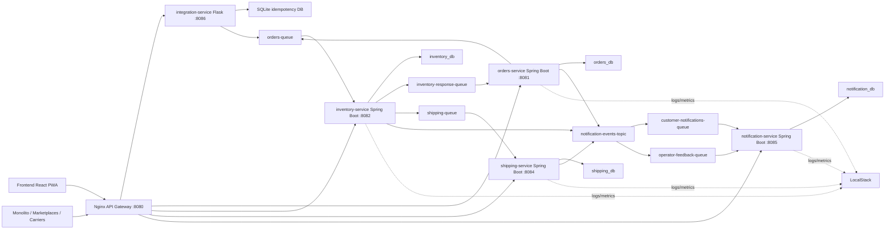

# Arquitectura y configuracion de SmartLogix

> Nota: este documento refleja una revision previa del workspace. El alcance vigente para 2026-03-31 esta definido en [ARQUITECTURA_FINAL_AWS_SMARTLOGIX.md](C:\Microservicios\SmartLogix\ARQUITECTURA_FINAL_AWS_SMARTLOGIX.md), donde ya no se considera `integration-service` ni integracion por marketplaces.

Estado relevado: 2026-03-26

## 1. Alcance de esta revision

Este documento describe el estado actual del workspace `C:\Microservicios\SmartLogix` a partir de la estructura y configuracion inspeccionada en codigo.

Puntos importantes:

- La raiz `SmartLogix` no es un unico repositorio Git.
- `Backend` y `Frontend` son repositorios separados.
- El documento describe arquitectura, configuracion, despliegue y riesgos de consistencia detectados.
- No se ejecutaron builds ni tests en esta revision; el contenido refleja el estado del codigo y archivos de configuracion presentes.

## 2. Mapa del workspace

```text
SmartLogix/
|- Backend/
|  |- event-contracts/
|  |- integration-service/
|  |- inventory-service/
|  |- notification-service/
|  |- orders-service/
|  |- shipping-service/
|  |- docker-compose.yml
|  |- nginx.conf
|  |- fly.toml
|  |- k8s-manifests/
|  |- k8s-manifests-optimized/
|  |- scripts/
|  |- openapi/
|  \- docs y scripts operativos
|- Frontend/
|  |- src/
|  |- public/
|  |- package.json
|  |- vite.config.ts
|  |- tailwind.config.ts
|  \- smartlogix-bff-openapi.yaml
\- SmartLogix.docx
```

## 3. Resumen ejecutivo

SmartLogix esta organizado como una plataforma con:

- Un frontend React + Vite + TypeScript + Tailwind + PWA.
- Un backend de microservicios Java Spring Boot para ordenes, inventario, envios y notificaciones.
- Un servicio de integracion en Flask que cumple tres roles a la vez:
  - autenticacion local/JWT/Cognito,
  - ingestion de webhooks externos,
  - BFF para el frontend.
- Un API Gateway Nginx que centraliza autenticacion y ruteo en desarrollo local via Docker Compose.
- Postgres para persistencia de los microservicios Java.
- LocalStack para SQS, SNS, CloudWatch Logs/Metrics y otros servicios AWS simulados.
- Un contrato de eventos compartido en `event-contracts`.

La arquitectura real hoy esta mas cerca de este flujo:



## 4. Backend

### 4.1 Componentes principales

| Componente | Stack | Puerto | Rol |
| --- | --- | --- | --- |
| `api-gateway` | Nginx 1.27 alpine | 8080 externo / 80 interno | Gateway HTTP, CORS, `auth_request`, proxy a servicios |
| `integration-service` | Flask 3.0.3 + boto3 + PyJWT | 8086 | Login, validacion JWT/API key/HMAC, BFF, webhooks externos |
| `orders-service` | Spring Boot 3.4.3, Java 21 | 8081 | Alta de ordenes, persistencia, publicacion a cola, confirmacion/rechazo |
| `inventory-service` | Spring Boot 3.5.11, Java 21 | 8082 | Consulta de stock, descuento, respuesta a orden, disparo de envio |
| `shipping-service` | Spring Boot 3.5.11, Java 21 | 8084 | Creacion de envios y tracking interno |
| `notification-service` | Spring Boot 3.5.11, Java 21 | 8085 | Persistencia de eventos de notificacion por orden/audiencia |
| `event-contracts` | JAR Java compartido | n/a | DTOs validados para eventos SQS/SNS |
| `postgres-db` | PostgreSQL 15 | 5432 | Base de datos para microservicios Java |
| `localstack` | LocalStack latest | 4566 | Emulacion AWS local |

### 4.2 Flujo funcional principal de ordenes

#### Flujo interno por REST + eventos

1. El frontend o un cliente autorizado crea una orden via `POST /api/orders`.
2. `orders-service` persiste la orden en `orders_db`, la deja en estado `CREATED` y publica un `OrderEvent` a `orders-queue`.
3. `inventory-service` consume `orders-queue`, valida el evento, descuenta stock y publica:
   - `InventoryResponse` a `inventory-response-queue`,
   - `ShippingEvent` a `shipping-queue` si hay stock,
   - `NotificationEvent` a SNS.
4. `orders-service` consume `inventory-response-queue` y actualiza la orden a `CONFIRMED` o `REJECTED`.
5. `shipping-service` consume `shipping-queue`, crea el envio en `shipping_db` y publica evento de notificacion.
6. SNS hace fan-out a dos colas SQS:
   - `customer-notifications-queue`,
   - `operator-feedback-queue`.
7. `notification-service` consume ambas colas y persiste `notification_records`.
8. El BFF en `integration-service` agrega orden, envio y notificaciones para el frontend.

#### Flujo externo por webhook

1. Un sistema externo llama `POST /api/integrations/webhook/orders` o `/batch`.
2. `integration-service` valida autenticacion:
   - Bearer JWT local,
   - JWT Cognito,
   - API key,
   - firma HMAC,
   segun `AUTH_MODE`.
3. Normaliza el payload externo al modelo interno.
4. Aplica idempotencia con SQLite por `source + externalOrderId` o hash del payload.
5. Encola un envelope JSON en `orders-queue`.
6. A partir de ahi el resto del flujo sigue la misma saga interna.

### 4.3 API Gateway Nginx

`Backend/nginx.conf` implementa:

- CORS abierto para desarrollo.
- Un subrequest interno `/_auth` que consulta `integration-service`.
- Politicas de rol por ruta usando `X-Required-Roles`.
- Proxy a:
  - `/api/orders`
  - `/api/inventory`
  - `/api/shipments`
  - `/api/notifications`
  - `/api/integrations/*`
  - `/api/bff/*`

Roles por ruta en el gateway local:

- Ordenes: `Admin, Operador, Cliente`
- Inventario: `Admin, Operador`
- Envios: `Admin, Operador, Transportista`
- Notificaciones: `Admin, Operador, Cliente`
- Integraciones y BFF: controladas por `integration-service`

### 4.4 Persistencia

#### Bases PostgreSQL

`init-db.sql` crea cuatro bases:

- `orders_db`
- `inventory_db`
- `shipping_db`
- `notification_db`

#### Modelos persistidos

| Servicio | Tabla principal | Otras tablas |
| --- | --- | --- |
| orders-service | `orders` | `processed_events` |
| inventory-service | `inventory` | `processed_events` |
| shipping-service | `shipments` | `processed_events` |
| notification-service | `notification_records` | n/a |
| integration-service | SQLite `processed_events` | n/a |

Observaciones:

- Los microservicios Java implementan idempotencia de consumidor con `processed_events`.
- `notification-service` protege duplicados por `(eventId, targetAudience)`.
- `integration-service` usa SQLite montado en `integration-service/data/webhook_idempotency.db`.

### 4.5 Mensajeria y topologia AWS local

Bootstrap principal: `Backend/init-sqs.sh/create-queues.sh`

Recursos creados:

- Colas principales:
  - `orders-queue`
  - `inventory-response-queue`
  - `shipping-queue`
  - `customer-notifications-queue`
  - `operator-feedback-queue`
- DLQ por cada cola principal.
- Topic SNS:
  - `notification-events-topic`

Politicas relevantes:

- Todas las colas principales quedan con DLQ y `maxReceiveCount`.
- SNS publica a las colas de notificacion via suscripciones filtradas por `audience`.
- Fan-out configurado:
  - `CLIENT` o `BOTH` -> `customer-notifications-queue`
  - `OPERATOR` o `BOTH` -> `operator-feedback-queue`
- El script tambien tiene runbook de:
  - `status`
  - `purge`
  - `rehydrate`
  - `recover`

### 4.6 Configuracion por servicio

#### orders-service

- `server.port=8081`
- Spring Web + JPA + Validation + Actuator
- Publica a SQS `orders-queue`
- Consume SQS `inventory-response-queue`
- Publica notificaciones a SNS
- DB default local: `jdbc:postgresql://localhost:5432/orders_db`
- Exposicion Actuator: `health,metrics,prometheus`
- Spring profile local recomendado: `local-cloudwatch`

#### inventory-service

- `server.port=8082`
- Expone `GET /api/inventory` y `GET /api/inventory/{sku}`
- Consume `orders-queue`
- Publica `inventory-response-queue` y `shipping-queue`
- Publica notificaciones a SNS
- DB default local: `inventory_db`
- Carga inicial automatica si la tabla esta vacia con SKUs:
  - `MACBOOK-PRO-M3`
  - `IPHONE-15`
  - `AIRPODS-PRO`
  - `LOGITECH-MX-MASTER`

#### shipping-service

- `server.port=8084`
- Expone `GET /api/shipments` y `GET /api/shipments/{orderId}`
- Consume `shipping-queue`
- Genera tracking `TRACK-XXXXXXXX`
- DB default local: `shipping_db`
- Publica notificaciones a SNS

#### notification-service

- `server.port=8085`
- Expone:
  - `GET /api/notifications/order/{orderId}`
  - `GET /api/notifications/audience/{audience}`
- Consume:
  - `customer-notifications-queue`
  - `operator-feedback-queue`
- DB default local: `notification_db`

#### integration-service

Endpoints importantes:

- `POST /api/integrations/auth/login`
- `GET /api/integrations/auth/check`
- `POST /api/integrations/webhook/orders`
- `POST /api/integrations/webhook/orders/batch`
- `GET /api/bff/dashboard/summary`
- `GET /api/bff/orders/{orderId}/timeline`
- `GET /api/bff/integrations/status`
- `GET /api/bff/reports/operations`
- `GET /api/bff/operations/overview`
- `GET /health`

Capacidades:

- Login local con usuarios mock:
  - `admin`
  - `operador`
  - `cliente`
  - `transportista`
- Modo de auth configurable:
  - `api_key`
  - `jwt`
  - `cognito`
  - `hybrid`
- Soporta JWT HS256 local y Cognito JWKS.
- Hace agregacion BFF consultando a `orders-service`, `inventory-service`, `shipping-service` y `notification-service`.
- Mide salud de integraciones externas via:
  - `MONOLITH_HEALTH_URL`
  - `MARKETPLACES_HEALTH_URL`
  - `CARRIERS_HEALTH_URL`

### 4.7 Contratos compartidos

`event-contracts` define:

- `OrderEvent`
- `InventoryResponse`
- `ShippingEvent`
- `NotificationEvent`

Todos incluyen validaciones `jakarta.validation`, lo que hace que los consumers fallen rapido si el payload no cumple el contrato esperado.

### 4.8 Observabilidad

Configuracion actual:

- Logs y metrics orientados a CloudWatch, con LocalStack en local.
- Actuator expuesto en los servicios Java.
- `MetricsCollector` existe al menos en los servicios Java para contadores/timers.
- `management.metrics.export.cloudwatch.enabled=true`
- Namespace de metrics: `SmartLogix`

Limitacion actual:

- La configuracion `CloudWatchLoggingConfig` registra intencion de uso, pero no se observa en este relevamiento un appender dedicado de logs hacia CloudWatch; la integracion real depende del stack runtime.

## 5. Frontend

### 5.1 Stack

`Frontend/package.json` muestra:

- React 18.3.1
- React Router 6.30.1
- TypeScript 5.7.2
- Vite 6.0.5
- Tailwind CSS 3.4.17
- `vite-plugin-pwa`
- `@base-ui/react`
- `lucide-react`
- `shadcn`

### 5.2 Estructura de aplicacion

```text
src/
|- app/           # router, auth, control de acceso
|- components/    # layout, comunes y UI
|- data/          # datos demo
|- hooks/         # fetch, online status, PWA, carga inicial
|- lib/           # cliente API, adapters, config local
|- pages/         # vistas de negocio
|- styles/        # tema global
\- types/         # contratos TS
```

### 5.3 Patron de consumo de backend

El frontend no llama servicios externos ni microservicios individuales por URL dedicada. Consume solo el gateway/BFF a traves de:

- `apiFetch()`
- `useApiQuery()`

Comportamiento relevante:

- URL base default: `VITE_API_BASE_URL` o `http://localhost:8080`
- Token bearer persistido en `localStorage`
- Fallback automatico a datos demo si el backend falla
- Banner visual para distinguir `live` vs `demo`

Esto significa que la UI puede seguir funcionando aunque el backend este caido, pero tambien implica que parte del equipo puede ver pantallas "operativas" con datos mock si no mira el banner de fuente de datos.

### 5.4 Auth y control de acceso

`src/app/auth.tsx` implementa:

- `AuthProvider`
- persistencia de sesion en `localStorage`
- login contra `POST /api/integrations/auth/login`
- expiracion por `expires_in`
- cierre de sesion automatico cuando el backend responde 401

Mapeo backend -> roles de UI:

- `Admin` -> `owner`
- `Operador` -> `ops`
- `Transportista` -> `shipper`
- `Cliente` -> `customer`
- `Soporte` -> `support`
- `Bodega` -> `warehouse`

Rutas visibles por rol:

- `owner`: dashboard, operations, inventory, orders, shipments, integrations, users, settings, reports, alerts
- `ops`: dashboard, operations, inventory, orders, shipments, reports, alerts, settings
- `warehouse`: dashboard, inventory, orders, alerts, settings
- `support`: dashboard, integrations, alerts, settings
- `customer`: dashboard, orders
- `shipper`: dashboard, shipments

### 5.5 Rutas principales

Rutas declaradas en `src/app/router.tsx`:

- `/dashboard`
- `/operations`
- `/inventory`
- `/inventory/:productId`
- `/orders`
- `/orders/:orderId`
- `/shipments`
- `/integrations`
- `/users`
- `/settings`
- `/reports`
- `/alerts`
- `/login`
- `/access-denied`

### 5.6 Vistas conectadas al backend

Pantallas con consumo real observado:

- Dashboard -> `/api/bff/dashboard/summary`
- Operations -> `/api/bff/operations/overview`
- Integrations -> `/api/bff/integrations/status`
- Orders -> `/api/orders`
- Order detail -> `/api/bff/orders/{orderId}/timeline`
- Inventory -> `/api/inventory`
- Inventory detail -> `/api/inventory/{sku}`
- Shipments -> `/api/shipments`
- Reports -> `/api/bff/reports/operations`
- Settings -> `/api/integrations/auth/check`

### 5.7 PWA y experiencia offline

Configuracion en `vite.config.ts` y `src/main.tsx`:

- `registerType: autoUpdate`
- `start_url=/`
- `display=standalone`
- `orientation=portrait`
- cache Workbox para `js, css, html, svg, png, ico`
- registro automatico del service worker
- callback `onOfflineReady`

### 5.8 Tema visual y UI system

Base de estilo:

- `components.json` indica `shadcn` style `base-nova`
- Tema de colores por CSS variables en `src/styles/index.css`
- Fuentes:
  - `Space Grotesk`
  - `Geist Variable`

La UI esta pensada mobile-first y con componentes reutilizables en:

- `src/components/common`
- `src/components/layout`
- `src/components/ui`

### 5.9 Configuracion editable en runtime

La pagina `SettingsPage` permite sin rebuild:

- cambiar `baseUrl`
- guardar un bearer token
- validar el token contra `/api/integrations/auth/check`

Persistencia en `localStorage`:

- `smartlogix-api-base-url`
- `smartlogix-api-token`
- `smartlogix-auth-session`

## 6. OpenAPI y contratos HTTP

Hay dos contratos OpenAPI:

- `Backend/openapi/smartlogix-bff-openapi.yaml`
- `Frontend/smartlogix-bff-openapi.yaml`

Observacion importante:

- No estan sincronizados.
- La copia de backend es mas completa.
- La copia de frontend no refleja todas las rutas actuales del BFF/auth/webhooks.

La fuente mas cercana al estado real hoy es la version de `Backend/openapi/`.

## 7. Variables de entorno y configuracion efectiva

### 7.1 Backend compartido

Variables repetidas en los servicios Java:

- `DB_URL`
- `DB_USER`
- `DB_PASSWORD`
- `JPA_DDL_AUTO`
- `AWS_REGION`
- `AWS_ACCESS_KEY_ID`
- `AWS_SECRET_ACCESS_KEY`
- `AWS_SQS_ENDPOINT`
- `AWS_CLOUDWATCH_ENDPOINT`
- `SPRING_PROFILES_ACTIVE`

Variables de mensajeria:

- `ORDERS_QUEUE`
- `INVENTORY_RESPONSE_QUEUE`
- `SHIPPING_QUEUE`
- `CUSTOMER_NOTIFICATIONS_QUEUE`
- `OPERATOR_FEEDBACK_QUEUE`
- `NOTIFICATION_TOPIC_ARN`

### 7.2 integration-service

Variables especificas:

- `PORT`
- `AUTH_MODE`
- `ALLOWED_ROLES`
- `INTEGRATION_API_KEY`
- `WEBHOOK_HMAC_SECRET`
- `JWT_SECRET`
- `JWT_ISSUER`
- `JWT_AUDIENCE`
- `JWT_ALGORITHMS`
- `COGNITO_REGION`
- `COGNITO_USER_POOL_ID`
- `COGNITO_APP_CLIENT_ID`
- `COGNITO_ISSUER`
- `COGNITO_JWKS_URL`
- `MONOLITH_HEALTH_URL`
- `MARKETPLACES_HEALTH_URL`
- `CARRIERS_HEALTH_URL`
- `IDEMPOTENCY_DB_PATH`
- `BACKFILL_BATCH_LIMIT`
- `ORDERS_SERVICE_URL`
- `INVENTORY_SERVICE_URL`
- `SHIPPING_SERVICE_URL`
- `NOTIFICATION_SERVICE_URL`

### 7.3 Frontend

Variables y almacenamiento:

- `VITE_API_BASE_URL`
- `localStorage` para URL base, token y sesion

## 8. Despliegue

### 8.1 Docker Compose local

`Backend/docker-compose.yml` es hoy el escenario mas completo funcionalmente porque incluye:

- Postgres
- LocalStack
- Nginx API Gateway
- integration-service
- orders-service
- inventory-service
- shipping-service
- notification-service

Diferencia importante respecto a produccion:

- Los servicios Java corren sobre imagen `maven:3.9.9-eclipse-temurin-21`
- Se monta el codigo fuente en `/workspace`
- Se ejecuta `spring-boot:run`

Es decir: Compose esta configurado como entorno de desarrollo/integracion, no como runtime inmutable de produccion.

### 8.2 Dockerfiles de servicios

Los servicios Java tienen Dockerfiles multi-stage que:

- instalan `event-contracts`
- compilan el JAR del servicio
- copian el JAR a una imagen `eclipse-temurin:21-jre-alpine`
- exponen healthcheck por Actuator

`integration-service` usa `python:3.12-slim`.

### 8.3 Kubernetes standard

`Backend/k8s-manifests/` despliega:

- namespace
- configmaps
- secrets
- postgres
- localstack
- orders-service
- inventory-service
- shipping-service
- notification-service
- ingress

Recursos por microservicio:

- replicas: 2
- HPA: min 2 / max 5

Limite importante:

- No despliega `integration-service`.
- No despliega `api-gateway` Nginx.
- Por lo tanto, el modelo auth/BFF/webhook de Compose no esta replicado completo en K8s.

### 8.4 Kubernetes optimizado

`Backend/k8s-manifests-optimized/` es una variante de costo reducido:

- replicas: 1
- HPA: min 1 / max 3
- README orientado a SMBs

Tambien:

- mantiene Postgres y LocalStack
- despliega solo los cuatro servicios Java
- tampoco incluye `integration-service` ni `api-gateway`

### 8.5 Fly.io

Archivos:

- `Backend/fly.toml`
- `Backend/fly-deploy.sh`

Estado actual:

- `fly.toml` esta claramente orientado a `smartlogix-integration`
- `fly-deploy.sh` primero despliega integracion y luego intenta reutilizar el mismo `fly.toml` para servicios Java

Esto implica que el despliegue Fly necesita una revision de consistencia antes de considerarse definitivo por servicio.

## 9. Scripts operativos y pruebas

### 9.1 Scripts backend

Scripts relevantes:

- `scripts/run-all-tests.ps1`
- `scripts/auth-gateway-e2e.ps1`
- `smoke-e2e.ps1`
- `scripts/test-login-demo.ps1`
- `scripts/test-login-integration.ps1`
- `setup-monolith-integration.sh`
- `test-monolith-integration.ps1`

### 9.2 Cobertura actual de pruebas

Lo observado:

- Tests Java por servicio existen, pero son minimos.
- Los tests unitarios/JUnit vistos son basicamente de arranque/contexto.
- La cobertura mas util hoy esta en los scripts PowerShell de smoke y auth E2E.

`run-all-tests.ps1` hace:

1. `docker compose up -d` opcionalmente con build
2. espera readiness del gateway
3. corre `smoke-e2e.ps1`
4. corre `auth-gateway-e2e.ps1`
5. genera reportes JSON en `scripts/reports/`

### 9.3 Flujo monolito -> SmartLogix

La documentacion y scripts existentes muestran que el camino esperado para integracion con monolito es:

- HMAC compartido
- webhook a `POST /api/integrations/webhook/orders`
- opcion de batch historico
- monitoreo via `/api/bff/operations/overview`

## 10. Hallazgos de consistencia y riesgos tecnicos

### 10.1 Diferencia entre Compose y Kubernetes

El desalineamiento mas importante hoy es este:

- Docker Compose incluye `integration-service` y `api-gateway`.
- Kubernetes despliega solo los servicios Java + infra.

Impacto:

- En K8s no queda representado el login local, el BFF, el auth gateway ni la recepcion de webhooks externos tal como estan definidos en Compose.

### 10.2 Ingress K8s standard incompleto respecto al optimizado

`k8s-manifests/08-ingress.yaml` expone en `smartlogix.local`:

- `/api/orders`
- `/api/shipments`
- `/api/notifications`

Pero no expone `/api/inventory` en ese host principal.

La variante `k8s-manifests-optimized/08-ingress.yaml` si agrega `/api/inventory`.

### 10.3 Configuracion Fly no separada por servicio

Hoy existe un solo `fly.toml` con:

- `app = "smartlogix-integration"`
- `image = "registry.fly.io/smartlogix-integration:latest"`

Y luego el script intenta desplegar servicios Java con esa misma base.

Riesgo:

- Para un despliegue real, Fly necesita al menos una configuracion por servicio o una forma clara de sobreescribir `app`, `image`, puerto y healthcheck.

### 10.4 OpenAPI duplicado y desfasado

Hay dos copias del contrato BFF/gateway y no coinciden.

Riesgo:

- El frontend puede terminar documentado contra un contrato que ya no representa el backend real.

### 10.5 Secretos y credenciales embebidos en configuracion

Se observaron secretos/credenciales de desarrollo definidos inline en archivos del repo, por ejemplo para:

- Postgres
- JWT local
- API key de integracion
- secreto HMAC

Riesgo:

- Aceptable para laboratorio local.
- No aceptable tal cual para ambientes reales sin externalizacion a secretos del entorno.

### 10.6 Versionado no homogeno entre microservicios

Se detectaron diferencias:

- `orders-service` usa Spring Boot 3.4.3 y `spring-cloud-aws` 3.3.0
- `inventory-service`, `shipping-service` y `notification-service` usan Spring Boot 3.5.11 y `spring-cloud-aws` 3.2.0

Riesgo:

- Mas complejidad de soporte, debugging y upgrades.

### 10.7 Frontend con fallback demo y sin scripts de test/lint

El frontend:

- cae a datos demo cuando el backend falla
- no declara scripts de `test` ni `lint` en `package.json`

Riesgo:

- La UX puede lucir sana aunque el backend este caido.
- La validacion automatica del frontend es limitada.

## 11. Recomendaciones de orden practico

Prioridad alta:

1. Unificar estrategia de despliegue:
   - o llevar `integration-service` y gateway a K8s,
   - o aclarar que K8s solo cubre el core de microservicios.
2. Separar configuracion Fly por servicio.
3. Declarar una sola fuente oficial de OpenAPI y generar la otra copia desde ahi.
4. Externalizar secretos de desarrollo fuera del repo si el proyecto sale de local.

Prioridad media:

1. Unificar versiones de Spring Boot y Spring Cloud AWS.
2. Agregar scripts de calidad en frontend (`lint`, `test`, `typecheck` dedicado).
3. Documentar formalmente cuando la UI esta en modo `demo` y cuando esta en modo `live`.

## 12. Conclusiones

El proyecto ya tiene una arquitectura bien definida para un flujo logistico desacoplado:

- UI aislada por gateway/BFF
- saga asincrona por SQS
- fan-out de notificaciones por SNS
- persistencia separada por contexto
- soporte de integracion con monolito y futuros canales externos

La base tecnica esta mas madura en Docker Compose que en Kubernetes/Fly, porque Compose es el unico escenario donde hoy aparece desplegada la historia completa:

- auth
- gateway
- BFF
- webhooks
- microservicios
- Postgres
- LocalStack

Si se quiere cerrar la arquitectura para ambientes reales, el siguiente trabajo deberia concentrarse en alinear despliegue, contratos OpenAPI y gestion de secretos.
