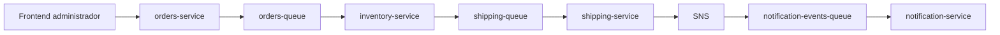

# Propuesta de solucion SmartLogix

## Problema que resuelve

SmartLogix busca ayudar a PYMEs de eCommerce que hoy trabajan con sistemas monoliticos y procesos manuales.

Eso genera tres problemas principales:

- stock desactualizado entre tiendas y bodegas,
- errores y retrasos en el procesamiento de pedidos,
- baja visibilidad y poca coordinacion en los envios.

La propuesta de solucion debe demostrar que una arquitectura de microservicios permite desacoplar esos procesos, automatizar eventos clave y soportar crecimiento sin rehacer todo el sistema.

## Modulos principales de la solucion

### 1. Gestion de inventario

Responsabilidad:

- mantener stock actualizado por SKU,
- validar disponibilidad en tiempo real,
- dejar base lista para crecer a multiples bodegas.

Microservicio asociado:

- `inventory-service`

### 2. Procesamiento de pedidos

Responsabilidad:

- registrar pedidos,
- validarlos automaticamente,
- actualizar su estado,
- dejar trazabilidad de cada cambio.

Microservicio asociado:

- `orders-service`

### 3. Coordinacion de envios

Responsabilidad:

- generar solicitudes de despacho,
- registrar envios por pedido,
- preparar el sistema para integracion posterior con transportistas.

Microservicio asociado:

- `shipping-service`

## Servicio transversal de notificaciones

Aunque no es uno de los tres modulos del enunciado, aporta mucho valor a la propuesta porque mejora trazabilidad y experiencia de usuario.

Responsabilidad:

- registrar eventos relevantes del flujo,
- separar mensajes para cliente y operador,
- dejar una capa simple de seguimiento operativo.

Microservicio asociado:

- `notification-service`

## Arquitectura propuesta para la primera version funcional

Para la primera entrega conviene mantener una arquitectura simple, demostrable y facil de explicar.

### Componentes base

- `orders-service`
- `inventory-service`
- `shipping-service`
- `notification-service`
- `event-contracts`
- `postgres`
- `localstack`

### Fuera de scope del MVP tecnico

Estos elementos pueden existir en el repositorio, pero no son obligatorios para validar la propuesta:

- integracion por webhooks o marketplaces
- integracion directa con transportistas
- despliegue productivo en Kubernetes o Fly.io

## Flujo funcional recomendado

## Como esta arquitectura responde al enunciado

### Separacion por dominio

Cada capacidad critica del negocio se resuelve en un servicio aislado:

- pedidos,
- inventario,
- envios,
- notificaciones.

Eso reduce acoplamiento y hace mas facil evolucionar cada modulo sin tocar todo el sistema.

### Escalabilidad

La comunicacion asincrona mediante colas desacopla el ingreso del pedido de la validacion de inventario y de la creacion del envio.

Eso permite soportar picos de demanda mejor que un flujo monolitico secuencial.

### Trazabilidad

El estado del pedido, el movimiento de inventario, la creacion del envio y las notificaciones quedan registrados.

Eso permite demostrar seguimiento operativo extremo a extremo.

### Flexibilidad para integraciones

El nucleo del sistema ya opera con eventos. Eso deja bien preparado el siguiente paso:

- sincronizar datos desde el monolito por base de datos,
- incorporar nuevas fuentes sin romper el core,
- desacoplar operacion transaccional y evolucion tecnica.

## Primera version funcional que si conviene entregar

La primera version funcional deberia demostrar lo siguiente:

1. un administrador puede crear pedidos,
2. el sistema valida stock automaticamente,
3. el pedido queda registrado y trazable en estado operativo,
4. si hay stock, se genera un envio,
5. el sistema deja trazabilidad consultable desde endpoints,
6. el frontend puede visualizar estado de inventario, pedidos, envios y notificaciones.

## Estado actual del backend

Hoy el backend ya permite validar el nucleo de la propuesta:

- alta de pedidos,
- consulta de inventario,
- generacion de envios,
- consulta de notificaciones,
- ejecucion local con Postgres y LocalStack,
- flujo asincrono validado entre microservicios.

## Lo que falta para cerrar mejor la propuesta

Para que la solucion quede mas alineada con el enunciado de negocio, los siguientes pasos son los mas utiles:

1. conectar el frontend a estos endpoints del core,
2. mostrar dashboards simples para pedidos, stock y envios,
3. exponer estados mas claros para operadores,
4. agregar autenticacion para administradores,
5. incorporar sincronizacion por base de datos con el monolito mediante `DMS`.

## Conclusion

La arquitectura actual si sirve para la propuesta de SmartLogix, siempre que la presentacion se enfoque en el MVP correcto:

- microservicios por dominio,
- mensajeria asincrona,
- trazabilidad del proceso logistico,
- frontend simple para operar,
- integraciones externas como siguiente fase y no como condicion para validar el modelo.
